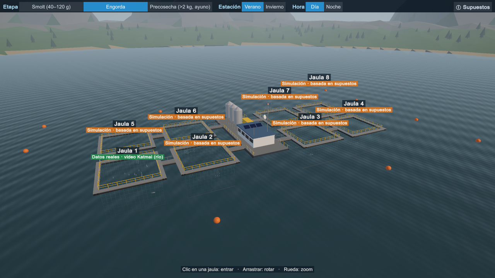

# Salmon Sim

Video submarino de salmones → detección y tracking → métricas → salmonera 3D en Unity,
donde una jaula reproduce los peces reales del video y las demás simulan un cardumen.



## Qué hay en el repo

| Carpeta | Contenido |
|---------|-----------|
| `vision/` | Pipeline de visión (notebook de Colab, `vision/salmon_vision.ipynb`): YOLOE + ByteTrack → CSV |
| `data/` | Contrato entre visión y Unity: `trajectories.csv` + `meta.json` |
| `SalmonUnity/` | Proyecto Unity 6 (URP) con la salmonera |
| `tools/` | Generador de trayectorias sintéticas |
| `docs/capturas/` | Capturas de cada fase |

El contrato de datos y las reglas de trabajo están en [`CLAUDE.md`](CLAUDE.md); cada parte
tiene además su propio `CLAUDE.md`.

## Visión

Video: tramo 1:30–2:00 de "Underwater Salmon Cam – Katmai 2022" (cámara fija en un río).
YOLOE (`yoloe-11l-seg`, prompt `"fish"`, `imgsz=1280`, `conf=0.25`) + ByteTrack
(`track_buffer=60`), filtro de IDs de menos de 1 s, profundidad por tamaño aparente y
suavizado de 7 frames. Resultado: 56 IDs, ~9 peces por frame. Detalle en
[`vision/CLAUDE.md`](vision/CLAUDE.md).

## Unity

1. Abre `SalmonUnity/` con Unity 6 (6000.1).
2. Abre `Assets/Scenes/SampleScene` y dale Play: toda la salmonera se arma por código.
3. Unity lee `Assets/StreamingAssets/trajectories.csv`; si regeneras `data/trajectories.csv`,
   cópialo ahí.

En Play:
- **Vista general:** arrastrar rota, la rueda hace zoom, clic en una jaula para entrar.
- **Jaula 1 (datos reales):** los 56 peces del video, con HUD y panel de métricas.
- **Jaulas 2–8 (simulación):** cardumen boids en anillo. La barra superior cambia
  etapa, estación, hora y corriente; "ⓘ Supuestos" muestra cada supuesto con su fuente.
- **Alimentación:** comidas automáticas de día y botón "Alimentar ahora". Los peces con
  hambre suben al esparcidor; los pellets que nadie come se los lleva la corriente y
  salen por la red ("Alimento no consumido (%)").
- **Corte lateral** (botón en la vista general): fondo a ~35 m, fondeo con anclas y
  perfil de la corriente por profundidad.
- **"← Volver" / Esc:** regresa a la vista general.

## Datos sintéticos (opcional)

```bash
python tools/generate_fake_trajectories.py --fish 40 --seconds 30 --out data/synthetic
```

Sin `--out` escribe en `data/` y **reemplaza los datos reales**.

## Estado

Hecho: pipeline de visión sobre Katmai y fases 1–5 de Unity (escena, navegación,
cardumen simulado, selectores de etapa/estación/hora, supuestos con fuentes; fondo,
fondeo, corriente y alimentación con alimento no consumido).

Pendiente: fase 6, video de una salmonera real, métricas en Python, demo grabada y
presentación.

## Experimento de tokens (opcional)

Instala un MCP de grafo de código (p. ej. `tokensave`) en **una** copia del repo,
haz la misma pregunta con y sin él, y compara con `/context`. Anota resultados en
`experimentos.md` — sirve como slide para la feria.
